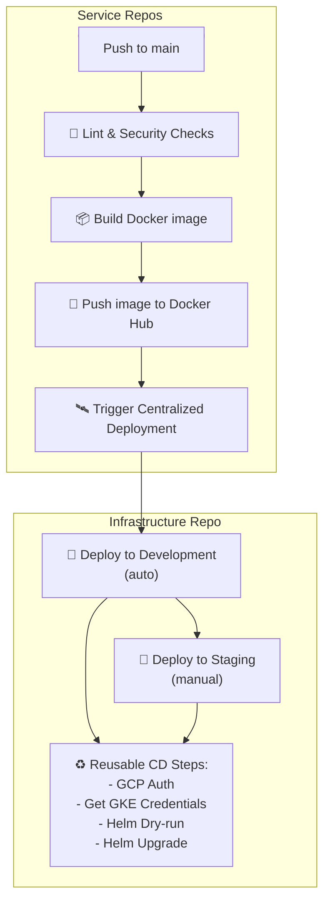
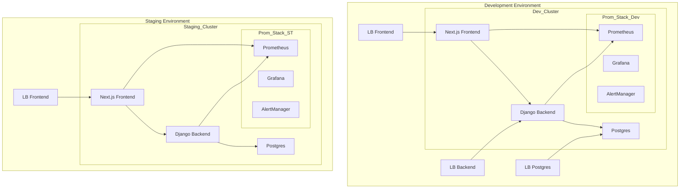

# 🚀 Astra+ Infrastructure

## 📝 Overview
This repository contains **infrastructure and CI/CD** for the multi-repository microservices project **Astra+**.  
Focus: DevOps work — centralized deployment to **GKE**, secrets management, **Terraform** for infrastructure, **Helm** for services, **GitHub Actions** for CI/CD.

---

## ✨ Key Features
- 🗂 **Multi-repository architecture:** separate repositories for frontend and backend; infrastructure is centralized here.  
- ⚙️ **CI/CD:**  
  - CI lives in service repositories (frontend/backend).  
  - CD is centralized here: automatic deployment to development, manual to staging.  
- ☸️ **Kubernetes:** GKE, Helm charts for each service.  
- 🏗 **Infrastructure as Code:** Terraform modules for clusters, Postgres, Prometheus stack.  
- 📊 **Monitoring:** kube-prometheus-stack (Prometheus, Grafana, Alertmanager).  
- 🔑 **Secrets:** stored in GitHub Secrets; integration with GCP Secret Manager (planned).  

---

## 📂 Repository Structure
```
.
├── .github/workflows/        # CI/CD workflows (main and reusable)
├── for-backend/              # CI examples + Dockerfile for backend services
├── for-frontend/             # CI examples + Dockerfile for frontend services
├── helm-charts/              # Helm charts for Kubernetes (backend & frontend)
├── terraform/                # IaC for GCP and Kubernetes
├── docs/                     # Documentation (architecture, processes, guides)
├── LICENSE                   # License
├── .gitignore                # Git ignored files
└── README.md                 # Overview README (DevOps focus; links to docs/)
```
📖 Detailed structure described in [docs/repo-structure.md](./docs/repo-structure.md).

---

## 🌍 Environments
- 🟢 **development** — automatic deployment after CI.  
- 🟡 **staging** — manual deployment after successful development.  
- 🔴 **production** — planned (separate cluster, namespace, Ingress, TLS).  

---

## 🔐 Secrets and Variables

### Secrets
- `DB_USER`, `DB_PASSWORD`  
- `GCP_SA_KEY`  
- `BACKEND_CELERY_BROKER_URL`, `BACKEND_CELERY_RESULT_BACKEND`  
- `BACKEND_EMAIL_HOST_USER`, `BACKEND_EMAIL_HOST_PASSWORD`  
- `DJANGO_SECRET_KEY`  
- `DOCKERHUB_USERNAME`, `DOCKERHUB_TOKEN`  

### Variables
- `GCP_PROJECT_ID`  
- `GKE_CLUSTER_NAME`  
- `GKE_CLUSTER_LOCATION`  

---

## 🛠️ CI/CD Overview

1. **CI (frontend/backend):**  
   ✅ Lint, 🔐 Security (npm audit / bandit), 🧪 Tests (placeholder), 🐳 Build & Push Docker image, 📡 Dispatch CD.  

2. **CD (infra repo):**  
   - 🟢 Development: automatic cluster deployment.  
   - 🟡 Staging: manual deployment after dev.  
   - 🧩 Helm dry-run + real deploy.  

---

## 📊 Mermaid Diagrams

### CI/CD Flow


### Cluster Architecture


---

## 📌 Next Steps
- 📊 Add PostgresExporter to collect metrics from the database.
- 🔑 Move secrets to GCP Secret Manager.  
- 🌍 Add production environment (Ingress, TLS, separate namespace).  
- 📦 Move to GitOps (ArgoCD/Flux) for declarative deployment.  

---

## 📚 Documentation
- [CI/CD](./docs/ci-cd.md)  
- [Architecture](./docs/architecture.md)  
- [Secrets](./docs/secrets.md)  
- [Environments](./docs/environments.md)  
- [Terraform](./docs/terraform.md)  
- [Repository Structure](./docs/repo-structure.md)  
