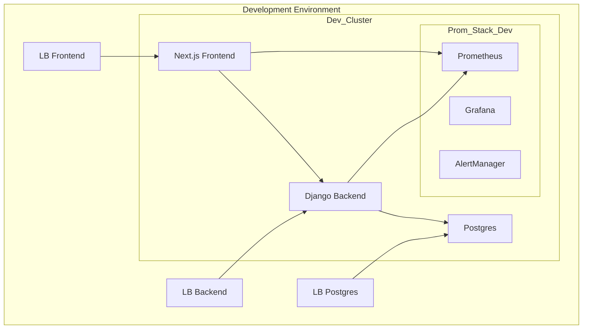
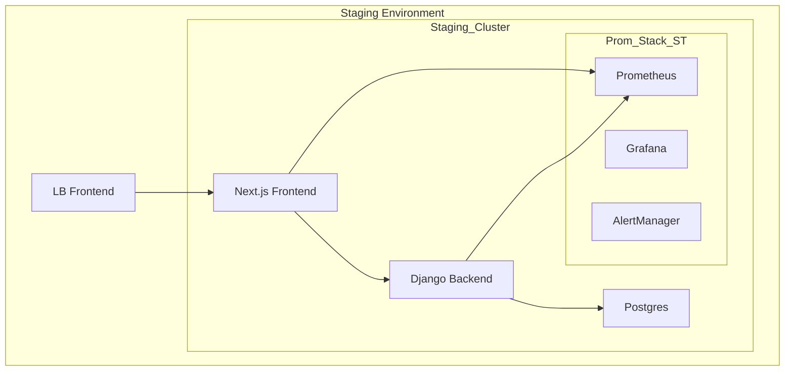
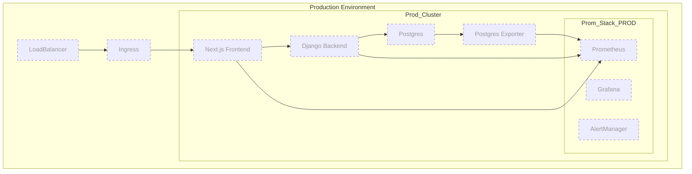

# 🏗 Infrastructure Architecture — tp154-infrastructure

This file describes the **environment structure and component interactions** for the **Astra+ project**.  
Diagrams are created using Mermaid for clarity.  

---

## 🌍 Development Environment

> In Development, all microservices are exposed for external access via LB (LoadBalancer).  
> This is necessary for:
> - rapid testing of frontend/backend integrations;  
> - service debugging;  
> - testing Prometheus/Grafana/AlertManager in a real environment.

---

## 🌐 Staging Environment

> In Staging, access is open only to Frontend for limited testing.  
> Backend and database are accessible only inside the cluster.

---

## ⚡ Production Environment (planned)

> The Production environment is shown with dashed lines to emphasize that it **does not exist yet**.  
> Access is open only to Frontend via Ingress.  
> Backend and database are hidden from external access.  
> Monitoring includes **Postgres Exporter** and Prometheus/AlertManager/Grafana.

---

## 📚 Documentation
- [CI/CD](./docs/ci-cd.md)  
- [Secrets](./docs/secrets.md)  
- [Environments](./docs/environments.md)  
- [Terraform](./docs/terraform.md)  
- [Repository Structure](./docs/repo-structure.md)  
