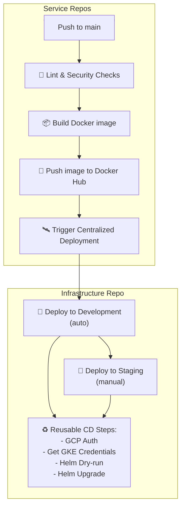

# ⚙️ CI/CD — tp154-infrastructure

## 📝 Purpose
This document describes **CI/CD processes** for the **Astra+ project**.  
Target audience: DevOps engineers, new team members working on service deployment and infrastructure.

---

## ✨ Key CI/CD Features
- 🗂 **Multi-repository architecture:** frontend and backend have separate repositories.  
- ⚙️ **CI (Continuous Integration):** executed in service repositories (frontend/backend).  
- ⚡ **CD (Continuous Deployment/Delivery):** centralized in this repository.  
- 🟢 **Development:** automatic deployment after CI.  
- 🟡 **Staging:** manual deployment after successful Development.  
- 🔴 **Production:** planned with restricted access (Ingress, TLS, Postgres Exporter, monitoring).

---

## 🛠️ CI/CD Workflow

### 1️⃣ Continuous Integration (CI)
- **Trigger:** push to `main` in service repositories.  
- **Steps:**
  - 🧪 **Lint** — code style check (ESLint/Prettier for frontend, flake8/black for backend).  
  - 🔐 **Security Checks** — npm audit / Semgrep for JS/TS; bandit for Python backend.  
  - 🧪 **Tests** — unit/integration tests (placeholders for future tests).  
  - 🐳 **Build Docker image** — tagged with commit SHA.  
  - 🚀 **Push image to Docker Hub**.  
  - 📡 **Dispatch centralized CD** to infrastructure repository.

### 2️⃣ Continuous Deployment (CD)
- **Location:** centralized repository `tp154-infrastructure`.  
- **Steps:**
  - 🌱 **Deploy to Development (auto)** — automatically after CI.
  - 🧩 **Reusable CD Steps:**
    - GCP authentication  
    - Obtain credentials for GKE  
    - Helm dry-run (chart verification)  
    - Helm upgrade/upgrade --install
  - 🚀 **Deploy to Staging (manual)** — performed after successful Development.

---

## 🌍 Environments and Access

| Environment | Access | Purpose |
|-------------|--------|---------|
| 🟢 Development | All services open (LB) | Quick testing, debugging, Prometheus/Grafana/AlertManager verification |
| 🟡 Staging | Only Frontend open | Limited testing, backend and database internal |
| 🔴 Production (planned) | Only Frontend via Ingress | Restricted access, monitoring, Postgres Exporter, planned rollout |

---

## 📊 Mermaid Diagrams

### CI/CD Flow

---

## 📚 Documentation
- [Architecture](./architecture.md)  
- [Secrets](./secrets.md)  
- [Environments](./environments.md)  
- [Terraform](./terraform.md)  
- [Repository Structure](./repo-structure.md)  
